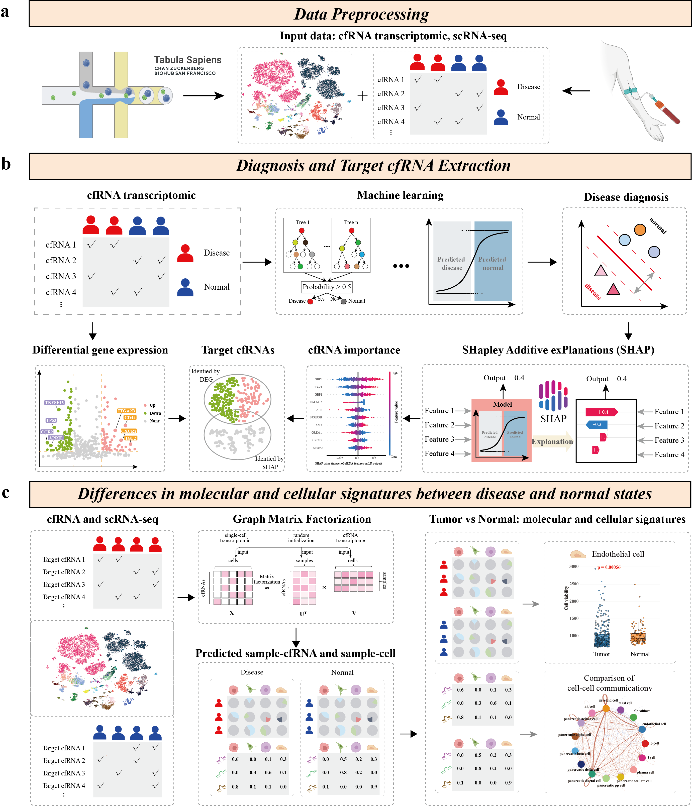

.. CellfreeGMF documentation master file, created by
   sphinx-quickstart on Tue Aug 26 14:44:50 2025.
   You can adapt this file completely to your liking, but it should at least
   contain the root `toctree` directive.

CellFreeGMF - diagnosis classification of samples, identify cfRNA biomarkers, and analyze the alterations in their originating cells based on graph matrix factorization
=========================

.. toctree::
   :maxdepth: 2

   Installation
   PDAC_diagnosis.ipynb
   PDAC_decon.ipynb
   PDAC_CC.ipynb
   PDAC_SC.ipynb

Abstract
========
Understanding the cellular origins of cell-free RNA (cfRNA) and their alterations is essential for elucidating disease-related molecular processes. Here, we propose CellFreeGMF, a tool designed to enable diagnosis classification of samples, identify cfRNA biomarkers, and analyze the alterations in their originating cells based on graph matrix factorization. Furthermore, by utilizing cell–cell communication analysis, CellFreeGMF investigates the functional alterations occurring in the cfRNA originating cells under disease conditions. We validate CellFreeGMF on diverse cell-free RNA transcriptome datasets. In the case of pancreatic ductal adenocarcinoma (PDAC), CellFreeGMF not only identified cfRNA biomarkers but also traced their cellular origins to myeloid and T-cell populations. Further analysis revealed significant transcriptomic differences in these cell populations between pathological and normal control groups. Our user-friendly toolkit, CellFreeGMF, enables identifying cfRNA biomarkers and elucidating pathophysiological changes in their source cells.\

Citation
========
Wenxiang Zhang. "Integrative Biomarker Discovery and Cell-of-Origin Tracing from Cell-Free Transcriptomes via Graph Matrix Factorization with Comparative Single-Cell Landscape Modeling in Health and Disease", Submitted.
